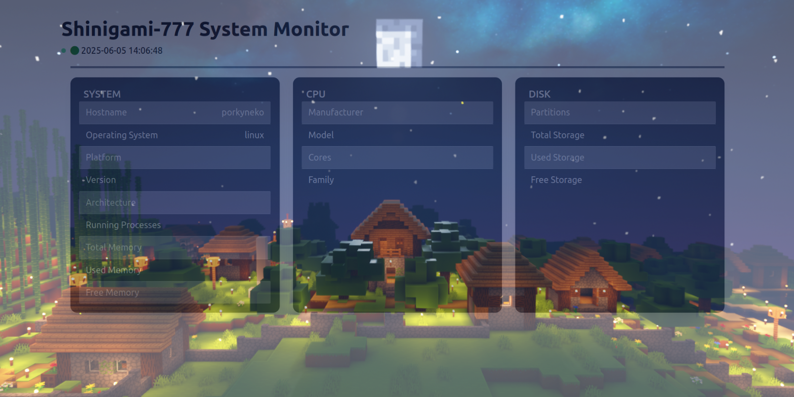

# MySystemMontior

This is a lightweight system monitoring tool written in Go. It uses `gopsutil` to gather system metrics, and delivers real-time updates to a modern web UI built with HTMX and WebSockets.

### Technologies Used

- Golang
- gopsutil
- HTMX
- WebSockets
- Tailwindcss

### How to use it?
Make sure you have Go installed on your system.\
Then run the following commands:
```
git clone https://github.com/shinigami-777/MySystemMontior.git
cd MySystemMontior
go run cmd/main.go
```
Open http://localhost:8080 on your browser to view the real time system info.

